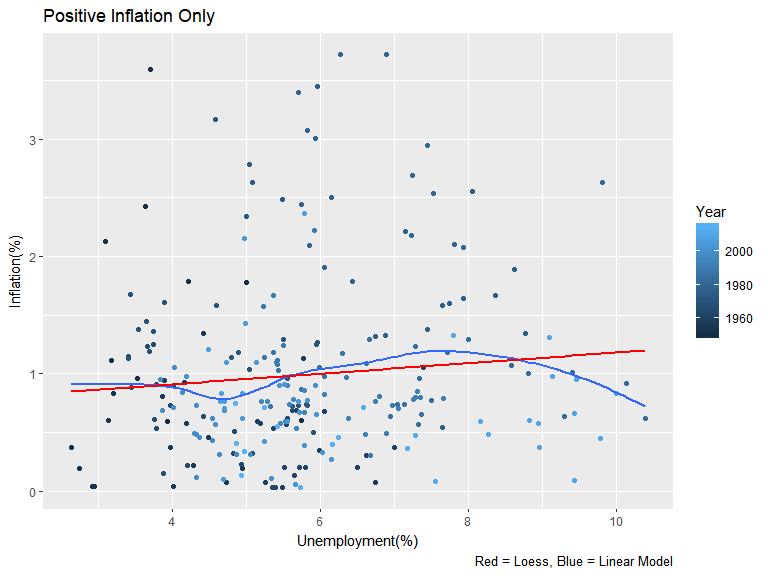
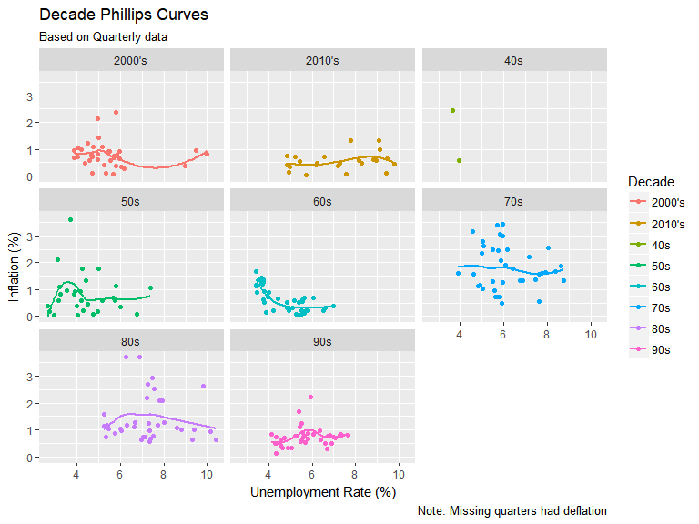

# Case Study Presentation
Carlos Mercado  
November 7, 2017  

## Intro 

"William Phillips, a New Zealand born economist, wrote a paper in 1958 titled The Relation between Unemployment and the Rate of Change of Money Wage Rates in the United Kingdom, 1861-1957, which was published in the quarterly journal Economica. In the paper Phillips describes how he observed an inverse relationship between inflation and unemployment in the British economy over the period examined. This relationship became known as the Phillip's Curve."

First, does this relationship hold in the United States? 


Second, is there more to the relationship than what William Phillips found? 


## Fast Answer

- William Phillips, having written his paper in 1958, was years ahead of his time. The Phillips Curve almost perfectly describes the US in the 1960s, but has lost its predictive abilities since. Overall, a statistically significant relationship has existed between the two. But, I found that significant problems arise when attempting to prove the relationship in the short-run. 


## Data Cleaning and Thought Process 

- Data uploaded to github 
 

- Data Cleaning 
- Two sided Approach 
- Long Run Analysis  
- Short Run Perspective & Problems 


## Data Cleaning
 
- Are there any misspellings or mislabelings? 
- Any missing Data? 
- Any impossible data? 
 

```
## $Data
## [1] "Consumer Price Index" "Unemployment Level"   "Civilian Labor Force"
## [4] "CPI"                 
## 
## $Year
##  [1] 1947 1948 1949 1950 1951 1952 1953 1954 1955 1956 1957 1958 1959 1960
## [15] 1961 1962 1963 1964 1965 1966 1967 1968 1969 1970 1971 1972 1973 1974
## [29] 1975 1976 1977 1978 1979 1980 1981 1982 1983 1984 1985 1986 1987 1988
## [43] 1989 1990 1991 1992 1993 1994 1995 1996 1997 1998 1999 2000 2001 2002
## [57] 2003 2004 2005 2006 2007 2008 2009 2010 2011 2012 2013 2014 2015 2016
## [71] 2017
## 
## $Month
##  [1]  1  2  3  4  5  6  7  8  9 10 11 12
```
- CPI and Consumer Price Index are the same 
- The years and months are correct 

## Data Cleaning 
- Is it really true that no data is missing? 
Originally, 0% of each column is coded as missing (NA)

```
##  Data  Year Month Value 
##     0     0     0     0
```

```
## 
## Civilian Labor Force Consumer Price Index                  CPI 
##                  276                  804                   38 
##   Unemployment Level 
##                  830
```
- Yet there are an unequal number of "Data" entries
- Not Equal = The missing data was hidden! 

## Data Cleaning  
- Reshape the data into proper format: every row an observation and every column an element of that single observation.
- Combine "Consumer Price Index" and "CPI" into one name 
- Expect Civilian Labor Force data to be missing 


```
##    Year Month Civilian Labor Force   CPI Unemployment Level     Date
## 9  1947     9                   NA 22.84                 NA Sep 1947
## 10 1947    10                   NA 22.91                 NA Oct 1947
## 11 1947    11                   NA 23.06                 NA Nov 1947
## 12 1947    12                   NA 23.41                 NA Dec 1947
## 13 1948     1                60230 23.68               2034 Jan 1948
## 14 1948     2                   NA 23.67               2328 Feb 1948
## 15 1948     3                   NA 23.50               2399 Mar 1948
```
- A sneak peak at a few early rows 
- Besides 1947, most data is available. 
- The data has been reformmated, adding NA for Civilian Labor Force data 
- Every year has every month except 2017 - the data stops at February 2017 

## Data Cleaning 
- A more accurate measure of missing data

```
##                 Year                Month Civilian Labor Force 
##           0.00000000           0.00000000           0.67220903 
##                  CPI   Unemployment Level                 Date 
##           0.00000000           0.01425178           0.00000000
```

While Unemployment Levels are available for every year since 1948 and CPI available totally, labor force levels are only recorded for about 1/3rd of the time. Essentially, every third month since 1948. 

To get a full picture of the Phillips Curve I want to approach from two angles: 
- First - using quarterly data (i.e. the 1/3rd of data with all elements) I want to check for a general relationship between inflation (% change in CPI) and unemployment rate (level divided by labor force) in the Long Run. 

- Second, imputing missing labor force data from nearby data, I want to test the hypothesis that small changes in prices (% change monthly) correlate with small changes in unemployment (% change in unemployment level) in the Short Run.   

## The Phillips Curve in the US Long Run 
- Quarterly Data 1948 - 2017 
- Inflation - % change in CPI 
- Unemployment Rate - % of labor force, unemployed 


## The Phillips Cuve in the Long Run 

-Generally speaking, inflation and the unemployment rate aren't related in the long-run. This fits the theory developed in the 1970's that a "natural" rate of unemployment exists.

<!-- -->

## The Phillips Curve in the Long Run 
- Adjusting for Phillips Curve Assumptions 

<!-- -->

- NAIRU holds in the long run, no noticeable relationship. 

## The Phillips Curve in the US Short Run 

- Long run as envelopes of the short run, i.e. Inter-decade phillips curves 

- Splitting the data by decades to see if any particular time period shows a similar relationship

- The 1960s look exactly like a Phillips Curve! 
<!-- -->


## The Phillips Curve in the Short Run - Allowing Deflation  

- Keeping the decades grouping, can we identify the correlation between changes in inflation and unemployment rates. That is, second derivatives of prices and unemployment. 

To do this, I want to do three things: 

- I want to impute missing civilian labor force values by reverting to the values of the previous quarter. These errors will be small, but worth it, for assessing short term changes in unemployment. Thus, we get Monthly instead of Quarterly data. 

- Calculate the changes in inflation rate and unemployment rate 

- Test the significance of their correlation by decade (short run) and in aggregate (long run)


```
## # A tibble: 6 x 5
## # Groups:   Decade [1]
##   Unem.Rate inflation Decade dinflation dUnem.Rate
##       <dbl>     <dbl>  <chr>      <dbl>      <dbl>
## 1      3.38      0.00    40s       0.00       0.00
## 2      3.87     -0.04    40s      -0.04       0.49
## 3      3.98     -0.72    40s      -0.68       0.11
## 4      3.94      1.36    40s       2.08      -0.04
## 5      3.50      0.80    40s      -0.56      -0.44
## 6      3.66      0.58    40s      -0.22       0.16
```

## Time Series Plots 
<!-- -->

## A Short Run Analysis - Allowing Deflation 

- Does a significant relationship exist between small changes in the inflation rate and small changes in the unemployment rate within a decade? 


```
## # A tibble: 8 x 3
##   Decade `Correlation of small changes` Significance
##    <chr>                          <dbl>        <dbl>
## 1 2000's                           0.05         0.59
## 2 2010's                          -0.06         0.59
## 3    40s                          -0.27         0.21
## 4    50s                          -0.07         0.42
## 5    60s                           0.07         0.44
## 6    70s                          -0.03         0.71
## 7    80s                          -0.26         0.00
## 8    90s                           0.05         0.56
```
Generally, no, the 1980s, with a few periods of abnormally high unemployment being the exception. Small changes in inflation were well correlated at high levels of inflation and unemployment.  

## A short Run Analysis - Allowing Deflation 

- Does a significant relationship exist for the inflation rate and unemployment rate themselves within a decade? 


```
## # A tibble: 8 x 3
##   Decade `Correlation as a whole` Significance
##    <chr>                    <dbl>        <dbl>
## 1 2000's                    -0.13         0.16
## 2 2010's                     0.11         0.33
## 3    40s                    -0.28         0.19
## 4    50s                    -0.12         0.19
## 5    60s                    -0.56         0.00
## 6    70s                    -0.14         0.13
## 7    80s                    -0.10         0.28
## 8    90s                     0.12         0.21
```
Generally, no. This relates back to the plot of positive-only inflation. Besides the 1960s, exogenous influences prevent a direct relationship from being predictable.  

## A Final Word  

- Is there a long-run relationship between small changes in inflation and small changes in the unemployment rate? 


```
## 
## 	Pearson's product-moment correlation
## 
## data:  CPI48dc$dinflation and CPI48dc$dUnem.Rate
## t = -2.1894, df = 828, p-value = 0.02885
## alternative hypothesis: true correlation is not equal to 0
## 95 percent confidence interval:
##  -0.143177512 -0.007858682
## sample estimates:
##        cor 
## -0.0758674
```

Yes, Using all the available data, small increases in the inflation rate are significantly correlated with small decreases in the unemployment rate. Breaking it apart by decade, although still 120 data points of monthly data each, reduces our ability to identify statistical significance. This may say something about the *natural rates* of each statistic.  

## Conclusions 

- Does the relationship between inflation and unemployment hold in the US? 

Yes, a relationship between the two exists. In the long run, small changes in the inflation rate are related to small changes in the unemployment rate. 

- Uniquely, the relationship was most pronounced in the 1960's. Afterwards, the same concerns that plagued the theory in the US (the existence of stagflation in the 70s along with high unemployment) muddle the relationship. 

- Within any one decade, the Phillips Curve hasn't adequately described the general relationship between the two. This may be due to exogenous influences unique to the decade (e.g. stagflation or changes in government spending). 

- *A change in the what could best be described as the "natural rate" of inflation is related to a change in the "natural rate" unemployment.*

