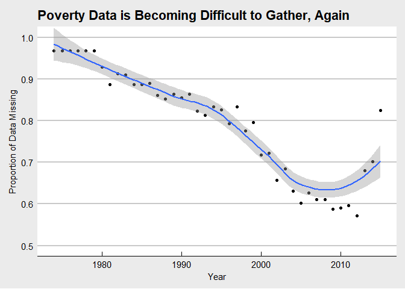
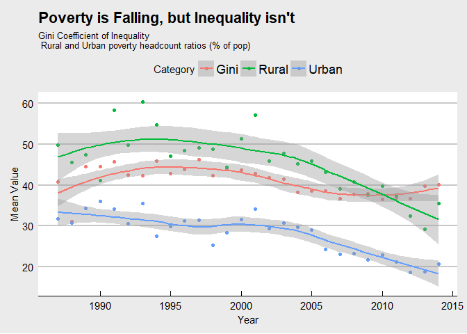

# Data Visualization
Carlos Mercado  
August 20, 2017  

## Download the Data 

Due the the Poverty & Equity API being down for the past 48 hours, I used the world bank data catalog to download the database in bulk. 


```r
fileUrl <- "http://databank.worldbank.org/data/download/PovStats_csv.zip"
download.file(fileUrl, destfile = "./PovStats.zip")

filenames <- unzip("PovStats.zip", list = TRUE) #returns file names 
PovData <- read.csv(filenames[1,1], stringsAsFactors = FALSE) #PovStatsData.csv
```

The data contains 5,394 observations (countries x stat) for 47 variables (Name, Stat, and over 40 years) 

#First Visualization

### Missing Data

Before using any dataset to draw inferences and conclusions we must identify how much of the data is missing, if there are patterns in the missing data, and if possible, why it is missing. 


```r
library(ggplot2, quietly = TRUE)
library(gridExtra, quietly = TRUE)
library(ggthemes, quietly = TRUE)

ProportionNA <- function(x){
        mean(is.na(x))} #identifies the proportion of NAs 

ProportionData <- sapply(PovData[,5:46],ProportionNA)
yearlist <- as.numeric( 
        gsub("X","",
             names(PovData)[5:46]
             )
        )  #get the years, remove the X, and make them numerics 

ProportionDF <- cbind.data.frame(yearlist, ProportionData) #put them in a Data Frame 

vis1 <- ggplot(aes(x = yearlist, y= ProportionData), data = ProportionDF) 
vis1 <- vis1 + geom_point() + geom_smooth(method = "loess")  + theme_economist_white()
vis1 <- vis1 + labs(x = "Year", y = "Proportion of Data Missing")
vis1 <- vis1 + ggtitle("Poverty Data is Becoming Difficult to Gather, Again")
vis1 <- vis1 + coord_cartesian(ylim = c(.5,1))
vis1 
```

<!-- -->

From gathering only 5% of the desired data from 1975 to 1980 the World Bank consistently adapted and reduced the amount of data missing to about 60% from 2005 to 2012. Since then, data collection has fallen to the levels of the mid 1990's.   

#Second Visualization 

##Decreasing Poverty and Increasing Equity  

Out of the 31 unique indicators I want to specifically look at the GINI index and the rates of poverty. There are numerous poverty indicators, so I am selecting two with relatively lower amounts of missing data: 

[1] "Rural poverty headcount ratio at national poverty lines (% of rural population), including noncomparable values"
[2] "Urban poverty headcount ratio at national poverty lines (% of urban population), including noncomparable values"


```r
Indicators <- unique(PovData$Indicator.Name)
#3rd indicator is GINI Index, a World Bank estimator of inequality 

library(dplyr, quietly = TRUE) 
IndicatorNA.table <- summarise_all(
        group_by(PovData,Indicator.Name),
        funs(ProportionNA)
) #shows the proportion of missing data for each indicator for each column 
# I used this to select the columns, some columns are understated due to 0, which 
#is illogical for some metrics (e.g. Poverty)

PovGini <- PovData[PovData$Indicator.Name == Indicators[3],] #GINI 
PovRural <- PovData[PovData$Indicator.Name == Indicators[25],] #rural 
PovUrban <- PovData[PovData$Indicator.Name == Indicators[31],] #urban 

#Note Poverty rates should not be zero, replacing with NAs 
PovRural[PovRural == 0] <- NA
PovUrban[PovUrban == 0] <- NA


GiniNA <- sapply(PovGini[,5:46],ProportionNA) #1974:1980 and 2015 have no data
#76% of the data is missing 

RuralNA <- sapply(PovRural[,5:46],ProportionNA) #1974:1983, 1986 have no data
#84% of the data is missing

UrbanNA <- sapply(PovUrban[,5:46],ProportionNA) # 1974:1983,1986 have no data
#83% of the data is missing
```

Trimming the data to only Gini, Rural poverty headcount, and Urban Poverty headcount for the years 1987:2014. 


```r
framemaker <- function(df, factorname){
        df <- cbind.data.frame(df[,18:45],as.factor(rep(factorname,nrow(df))))

} #adds a marker (Gini, Rural, Urban) to each dataframe 
#also selects only years 1984:2014 where there is data for each 

Pov3 <- rbind.data.frame(framemaker(PovGini, "Gini"),
                         framemaker(PovRural, "Rural"),
                         framemaker(PovUrban, "Urban"))
colnames(Pov3) <- c(1987:2014,"Category")


library(reshape, quietly = TRUE)
Pov3 <- melt(Pov3, id = "Category")
colnames(Pov3) <- c("Category","Year","Value")

PovertySummary <- summarise_all(group_by(Pov3, Category, Year, add =TRUE),
                                funs(median,mean), 
                                na.rm = TRUE) 

meanplot <- ggplot(aes(x = as.numeric(as.character(Year)), y= mean,
                       color = Category), 
                   data = PovertySummary) + 
        geom_point() + geom_smooth(method = "loess") + 
        theme_economist_white() + xlab("Year") + ylab("Mean Value") + 
        labs(title = "Poverty is Falling, but Inequality isn't",
             subtitle = "Gini Coefficient of Inequality \n Rural and Urban poverty headcount ratios (% of pop)")

meanplot 
```

<!-- -->

In both Rural and Urban areas the poverty headcount ratio (as a percent of population) has decreased in 1987. Yet, Inequality with a GINI Coefficient within (.35 to .45) for over 25 years. 

#Third Visualization 

For bonus points, the third visualization is an interactive Shiny app whose link will be provided separately. 
