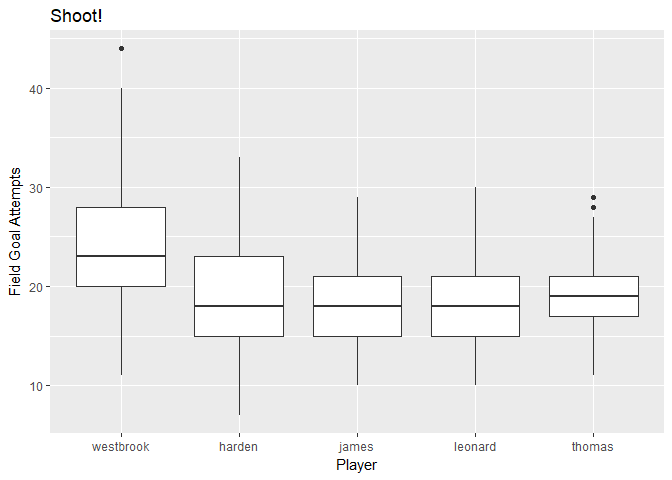
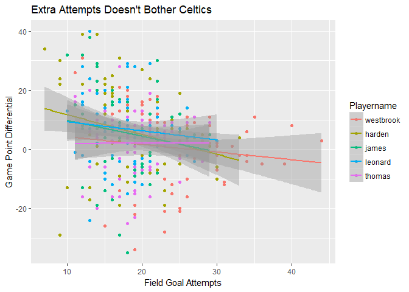
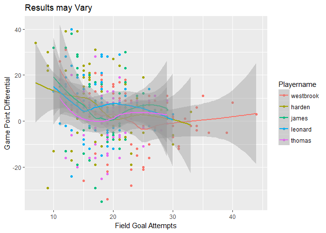
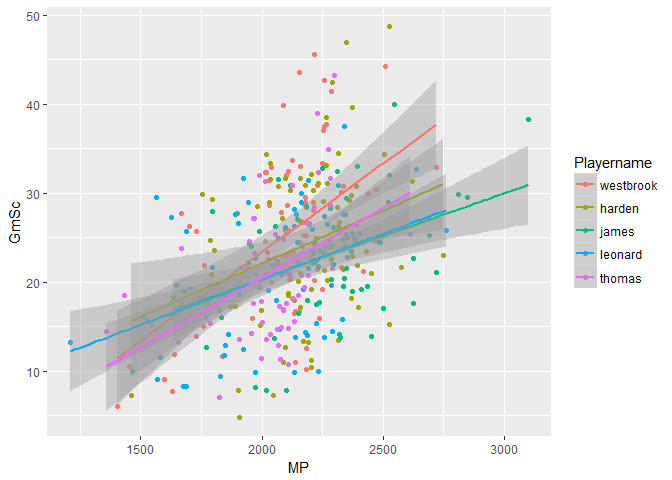
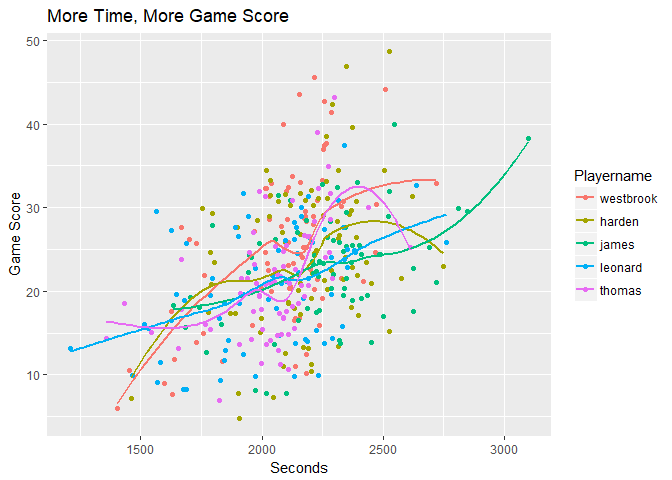

# Why Westbrook (or maybe Isaiah Thomas) is my Statistical MVP
Carlos Mercado  
June 11, 2017  


## Synopsis: 


## Downloading Data

All data were taken from basketball-reference.com. For each player the 2016-2017 season was selected using the site's CSV for Excel feature and then copied into a text file for each player. This "raw" data is available on Github. All download code is available on github. Note, NA's have been set for all player specific data for games where they did not play. 


```r
#online links 
westbrook.url <- "https://raw.githubusercontent.com/RafaJones/NBA/master/Westbrook.csv"
harden.url <- "https://raw.githubusercontent.com/RafaJones/NBA/master/Harden.csv"
james.url <- "https://raw.githubusercontent.com/RafaJones/NBA/master/James.csv"
leonard.url <- "https://raw.githubusercontent.com/RafaJones/NBA/master/Leonard.csv"
thomas.url <- "https://raw.githubusercontent.com/RafaJones/NBA/master/Thomas.csv"

#download 
download.file(westbrook.url, destfile = "./westbrook.csv")
download.file(harden.url, destfile = "./harden.csv")
download.file(james.url, destfile = "./james.csv")
download.file(leonard.url, destfile = "./leonard.csv")
download.file(thomas.url,destfile="./thomas.csv")

nastrings <- c("Did Not Play","Did Not Dress","Inactive","Not With Team")

#read with NAs 
westbrook <- read.csv("westbrook.csv", stringsAsFactors = FALSE ,na.strings = nastrings)
harden <- read.csv("harden.csv", stringsAsFactors = FALSE ,na.strings = nastrings)
james <- read.csv("james.csv",stringsAsFactors = FALSE ,na.strings = nastrings)
leonard <- read.csv("leonard.csv",stringsAsFactors = FALSE ,na.strings = nastrings)
thomas <- read.csv("thomas.csv",stringsAsFactors = FALSE ,na.strings = nastrings)

#fixing the original columns due to issues with R reading ' % '
fixednames <- names(westbrook) #they all start with the same colnames 
fixednames <- gsub("Rk","Team.Game", fixednames)
fixednames[2] <- "Player.Game"
fixednames[6] <- "Where"
fixednames[8] <- "Result"
fixednames[13] <- "FG.percent"
fixednames[14:16] <- c("3PM","3PA","3P.percent")
fixednames[19] <- "FT.percent"
fixednames[30]<- "Plus.Minus"
fixednames[31] <- "Playername"

#adding names for when all the data is merged 
westbrook <- cbind(westbrook, rep("westbrook",82))
harden <- cbind(harden, rep("harden",82))
james <- cbind(james,rep("james",82))
leonard <- cbind(leonard, rep("leonard",82))
thomas <- cbind(thomas,rep("thomas",82))

#replacing the columns
colnames(westbrook) <- fixednames
colnames(harden) <- fixednames
colnames(james) <- fixednames
colnames(leonard) <- fixednames
colnames(thomas) <- fixednames

#this splits the game result/differential column into two columns  
# Result (W or L) and Point.Diff

nbaresultsplit <- function(data) {
        data <- data %>% separate(Result, c("Result","PointDiff"),"\\(")
        data$PointDiff <- gsub("\\)","",data$PointDiff)
        data$PointDiff <- as.numeric(data$PointDiff)
        data$Result <- as.factor(data$Result)
        return(data)
}


#merging by rows 
allmvp <- rbind(westbrook,harden,james,leonard,thomas)
allmvp <- nbaresultsplit(allmvp)
allmvp$Where <- ifelse(allmvp$Where == "@", "Away","Home")

mvp.noNA <- na.omit(allmvp)
```

## Analysis 

6 data frames have been made. One for each player and one for all of them combined. 
To score the mvp I am making a simple contest. The most "mvp" points wins. A player gets 3 points for winning a category, 2pts for second place, 1 point for 3rd place and 0 otherwise. If two players tie they receive for 2pts each. 

The categories are:

###Home/Away Consistency 
Who brings it no matter where they play  

###Anti-Chucker 
Whose FGA are best correlated with team point differentials
A linear regression will be run for each player between FGA and game point differential 

###GameScore/Min -
When the going gets tough and they're playing more than average minutes 
Who has another gear.

###They Got Theirs - 
who has the highest percentage of postive plus/minuses in Losses 


```r
#Home/Away 
mvp.noNA <- group_by(mvp.noNA, Playername, Where, add = TRUE)

selectHA <- select(mvp.noNA,6,12,13,15,16,18,19,21:27,29,32)
HAtable <- summarise_each(selectHA, funs(mean),c(2:ncol(selectHA))) 
away <- HAtable[HAtable$Where=="Away",]
home <- HAtable[HAtable$Where=="Home",]

HAdif <- cbind(home$Playername,home[3:ncol(home)] - away[3:ncol(away)])

tabl = matrix(nrow = 5, ncol = 2)
for(i in 1:5) tabl[i,2] <- sum(HAdif[i,2:15]^2) 

HAsqsum <- cbind(as.data.frame(home$Playername),tabl[,2])
colnames(HAsqsum) <- c("Player","Net Home-Away Difference")

HAconsistency <- HAsqsum[order(HAsqsum$`Net Home-Away Difference`),]
```

### First - Kawhi "RoboCop" Leonard is immune to opposing crowds 

First up, the Home/Away Consistency score. A lower number indicates less difference between Home and Away game averages.

As defined by euclidian distance in n-dimensions. Where n is the following categories: 
FGM,FGA,3PM,3PA,FTM,FTA,ORB,DRB,PTS,AST,TOV

Our top 3 are Kawhi Leonard (3pts), Lebron James (2pt), and Russell Westbrook(1pt)


```r
HAconsistency
```

```
##      Player Net Home-Away Difference
## 4   leonard                 3.108821
## 3     james                 5.692959
## 1 westbrook                 5.954943
## 5    thomas                 8.072461
## 2    harden                 8.286562
```


These players are least affected by who they play, and Kawhi Leonard leads by a HUGE margin. Leading Lebron James by more than the difference between Lebron and 5th place Harden. 


##Next - Just keep shooting Isaiah! 

is the Anti-Chucker award. Whose Field Goal Attempts are most correlated with team point differential. Now, looking at a boxplot for FGA we notice a certain player named Westbook is the definition of an outlier haha. Let's see if the data holds this against him. 


```r
#FGA boxplots by player

gbox <- ggplot(aes(y = FGA, x = Playername),data=mvp.noNA) + geom_boxplot()+ 
        labs(title = "Shoot!", x = "Player", y= "Field Goal Attempts")


#FGA vs Resulting Point Differential 

gg <- ggplot(aes(x = FGA, y = PointDiff, color = Playername),data = mvp.noNA)
glmplot <- gg + geom_point() + geom_smooth(method = "lm") + 
        labs(title = "Extra Attempts Doesn't Bother Celtics",
             x = "Field Goal Attempts",
             y = "Game Point Differential")


coeftbl = NULL 
for(i in c("westbrook","james","leonard","thomas","harden")){
 coeftbl <- rbind(coeftbl,
lm(PointDiff~FGA, data = mvp.noNA[mvp.noNA$Playername == i,])$coefficients[2])
}
coeftbl <- cbind(c("westbrook","james","leonard","thomas","harden"),coeftbl)
coeftbl <- as.data.frame(coeftbl)
coeftbl[,2] <- as.numeric(as.character(coeftbl[,2]))
coeftbl <- coeftbl[order(coeftbl$FGA, decreasing = TRUE),]
colnames(coeftbl) <- c("Player","PointDiff per FGA")
```


```r
gbox 
```

<!-- -->


Looking at all the players FGA and the resulting team point differentials (colored by player) wee see a generally negative relationship for all players. This makes sense. Here's the linear relationship: 


```r
glmplot
```

<!-- -->

```r
coeftbl
```

```
##      Player PointDiff per FGA
## 4    thomas        0.00507626
## 1 westbrook       -0.25869643
## 3   leonard       -0.30716599
## 2     james       -0.53456266
## 5    harden       -0.67020056
```

Interestingly enough, Isaiah Thomas hit's the scoreboard with a strong 3pts for having NO relationship between shooting more and hurting his team. 2nd and third place are Westbrook(2pts) and Kawhi Leonard (1pt). Did Westbrook shoot his teams out of games? It seems the answer is barely! James Harden with a massive -.67 points for every (excessive) attempt was not what I expected. 

So, we have Kawhi leading with (4pts), Isaiah Thomas tied in second with Westbrook at 3pts each, and Lebron at 2pts. 

I won't be grading the players with this, but here is a non-linear regression for those interested in seeming more flow in the data.  


```r
gg <- ggplot(aes(x = FGA, y = PointDiff, color = Playername),data = mvp.noNA)
gloess<- gg + geom_point() + geom_smooth(method = "loess") +labs(title = "Results may Vary", x = "Field Goal Attempts", y = "Game Point Differential")
gloess
```

<!-- -->


### Third - Westbrook the Perpetual GameScore Machine 

Alright, our third metric, The game score per minute (converted to seconds). The idea behind this is to see two things. 

1) Looking at each player's peak Game Scores to see how they change when asked to play a little extra. 
2) Assess players who probably could average a little more, but didn't need to. I don't necessarily want to hold it against players whose teams were good enough to let them rest, but I personally consider MVP to be about a team's reliance on a player and much less than a "best player on the best team" award. 


```r
#thank you to "Jeff" from stackoverflow for the following function, I wanted to avoid adding more packages like lubridate. 
toSeconds <- function(x){
   if (!is.character(x)) stop("x must be a character string of the form H:M:S")
   if (length(x)<=0)return(x)

   unlist(
      lapply(x,
         function(i){
            i <- as.numeric(strsplit(i,':',fixed=TRUE)[[1]])
            if (length(i) == 3) 
               i[1]*3600 + i[2]*60 + i[3]
            else if (length(i) == 2) 
               i[1]*60 + i[2]
            else if (length(i) == 1) 
               i[1]
         }  
      )  
   )  
} 

mm <- mvp.noNA$MP  #changing the column from MM:SS to seconds
mm <- toSeconds(mm)
mvp.noNA$MP <- mm

gg <- ggplot(aes(x = MP, y = GmSc, color = Playername),data = mvp.noNA)
Gscoreglm <- gg + geom_point() + geom_smooth(method = "lm")
Gscoreloess <- gg + geom_point() + geom_smooth(method = "loess",se= FALSE) + 
        labs(x = "Seconds", y = "Game Score", 
             title = "More Time, More Game Score")
```

Here are the the two graphs, one linear, one non-linear. Along with the coefficient table for the player's linear regressions. 


```r
coeftbl2 = NULL 
for(i in c("westbrook","james","leonard","thomas","harden")){
 coeftbl2 <- rbind(coeftbl2,
lm(GmSc~MP, data = mvp.noNA[mvp.noNA$Playername == i,])$coefficients[2])
}
coeftbl2 <- cbind(c("westbrook","james","leonard","thomas","harden"),coeftbl2)
coeftbl2 <- as.data.frame(coeftbl2)
coeftbl2[,2] <- as.numeric(as.character(coeftbl2[,2]))
coeftbl2 <- coeftbl2[order(coeftbl2$MP, decreasing = TRUE),]
colnames(coeftbl2) <- c("Player","GmSc by Seconds")
```


```r
Gscoreglm
```

<!-- -->

```r
Gscoreloess
```

<!-- -->

```r
coeftbl2
```

```
##      Player GmSc by Seconds
## 1 westbrook     0.019965505
## 4    thomas     0.015679325
## 5    harden     0.011939007
## 3   leonard     0.010253185
## 2     james     0.009619449
```


Westbrook with a wild .02GmSc for every additional second played! with Thomas in 2nd place and Harden finally hitting the board with .011. 

Westbrook: 6pts 
Thomas: 5pts
Kawhi: 4pts 
James: 2pts
Harden:1pt 

### Last - Harden Gets His 

Alright, last but not least, the They Got Theirs award for box plus/minus in Losses. 


```r
losses <- mvp.noNA  
losses$Result <- as.character(losses$Result) #factors --> character 
losses$Result <- gsub(" ","",losses$Result) # remove extra space from splitting the column
losses <- losses[losses$Result == "L",] #subset by losses 
losses <- group_by(losses, Playername)

indivlosses <- table(losses$Playername, losses$Result)
posboxlosses <- table(losses$Playername, losses$Plus.Minus > 0)
posboxLpercent <- as.data.frame(table(losses$Playername, losses$Plus.Minus > 0)[,2]/indivlosses)

posboxLpercent <- posboxLpercent[,c(1,3)]
colnames(posboxLpercent) <- c("Player Name","Positive in Loss %")
posboxLpercent <- posboxLpercent[order(posboxLpercent$`Positive in Loss %`, decreasing = TRUE),]
```


First of all, congratulations to these 5 for only experiencing 127 losses combined this season.

Losses for games the player played in: 

```r
indivlosses
```

```
##            
##              L
##   westbrook 34
##   harden    27
##   james     22
##   leonard   19
##   thomas    25
```

TRUE/FALSE table for the statement: "Player lost while posting a BPM greater than zero."

```r
posboxlosses
```

```
##            
##             FALSE TRUE
##   westbrook    26    8
##   harden       18    9
##   james        18    4
##   leonard      17    2
##   thomas       19    6
```

So, who had the most positive individual games in losses? Numerically James Harden and then Westbrook, then Thomas. But let's see how it looks when made into a rate per loss. 


```r
posboxLpercent
```

```
##   Player Name Positive in Loss %
## 2      harden          0.3333333
## 5      thomas          0.2400000
## 1   westbrook          0.2352941
## 3       james          0.1818182
## 4     leonard          0.1052632
```
Harden makes a jump here is 3pt, followed by Thomas adding 2, and westbrook adding one. 

Our final score is: 
Westbrook: 7pts 
Thomas: 7pts
Kawhi: 4pts 
James: 2pts
Harden: 4pt  

Congratulations Russell Westbrook and Isaiah Thomas for tying in my statistical MVP award. 

I designed the tests without looking at the data first, so it'd feel wrong for me to come up with a random tiebreaker. I think breaking the record for most triple doubles will win it in my heart. 

Thank you for reading! 


