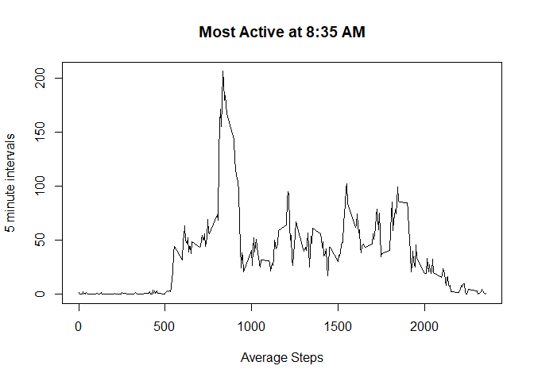
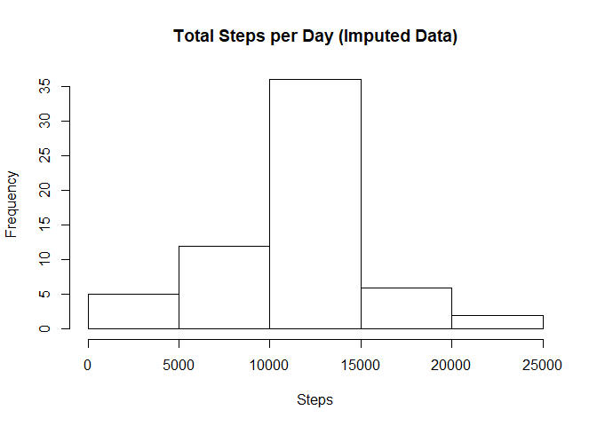
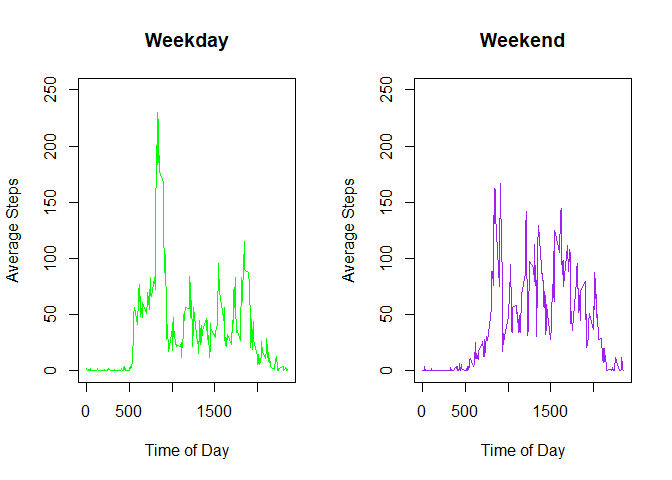

# PA1.Rmd
Carlos Mercado  
April 17, 2017  


#Evaluating Different Measures of Activity 

Using dplyr and base plotting. 

```r
library(dplyr)
```

```
## 
## Attaching package: 'dplyr'
```

```
## The following objects are masked from 'package:stats':
## 
##     filter, lag
```

```
## The following objects are masked from 'package:base':
## 
##     intersect, setdiff, setequal, union
```

1. Code to download, unzip and read the data 


```r
if(file.exists("activity.csv") == FALSE) {
fileUrl <- "https://d396qusza40orc.cloudfront.net/repdata%2Fdata%2Factivity.zip" 
download.file(fileUrl, destfile = "./activity")
unzip("activity")
}
activ <- read.csv("activity.csv")

summary(activ)
```

```
##      steps                date          interval     
##  Min.   :  0.00   2012-10-01:  288   Min.   :   0.0  
##  1st Qu.:  0.00   2012-10-02:  288   1st Qu.: 588.8  
##  Median :  0.00   2012-10-03:  288   Median :1177.5  
##  Mean   : 37.38   2012-10-04:  288   Mean   :1177.5  
##  3rd Qu.: 12.00   2012-10-05:  288   3rd Qu.:1766.2  
##  Max.   :806.00   2012-10-06:  288   Max.   :2355.0  
##  NA's   :2304     (Other)   :15840
```

There are 17568 rows x 3 observations: steps | date  |  interval 
61 days in total, ranging from October 1st to November 30th with 288 5 minute intervals per day

2. Evaluating how many total steps are taken per day. 


```r
activ <- tbl_df(activ)
activ <- group_by(activ,date)

sumsteps <- summarise_each(activ, funs(sum), steps) 
with(sumsteps, 
     hist(steps, xlab = "Steps", ylab = "Frequency", 
          main = "Total Steps per Day"))
```

<!-- -->

3. Including a quick summary for the mean and median steps (NAs removed automatically) 


```r
with(na.omit(sumsteps), summary(steps))
```

```
##    Min. 1st Qu.  Median    Mean 3rd Qu.    Max. 
##      41    8841   10760   10770   13290   21190
```

4. The average steps taken in each interval, across all 61 days. 
 Note: NAs had to be removed for summarise_each, which was 8 full days.
 

```r
intactiv <- group_by(activ,interval)
intsteps <- summarise_each(na.omit(intactiv), funs(mean), steps) 
with(intsteps, plot(interval, steps, type = "l", 
                    main = "Most Active at 8:35 AM",
                    xlab = "Average Steps",
                    ylab = "5 minute intervals"))
```

<!-- -->

5. On average, the most average interval was 835, or 8:35 AM. 


```r
most_active_interval <- intsteps[intsteps$steps == max(intsteps$steps),]
print(most_active_interval)
```

```
## # A tibble: 1 × 2
##   interval    steps
##      <int>    <dbl>
## 1      835 206.1698
```


6. Replacing NAs with mean steps for that interval  

starting by subsetting the 2304 NA rows, i.e. 8 full days of 288 interverals missing


```r
n_activ <- activ[is.na(activ),]
```

For the 8 days of NA I replaced each day's steps with the average steps of it's interval 


```r
nsteps <- n_activ$steps  #NA steps 
isteps <- intsteps$steps  #average steps per interval 

#manually repeated the averages for 8 days
n_activ$steps<- rep(isteps, length(nsteps)/length(isteps)) 

fulldata <- rbind(na.omit(activ),n_activ) #non NA data + imputed data 
fulldata<- fulldata[with(fulldata, order(date,interval)),] #ordered by date and interval 
```

This imputation would be much better if it referenced sumsteps to replace the NA based 
on matching each table's interval column, I just don't know how to code that efficiently.

7. Using the imputed data, I recalculate the sum of steps taken per day


```r
sumfullsteps <- summarise_each(fulldata, funs(sum), steps) 
with(sumfullsteps, 
     hist(steps, xlab = "Steps", ylab = "Frequency", 
          main = "Total Steps per Day (Imputed Data)"))
```

<!-- -->
  
  There is a very small difference in Median and Mean steps taken. 

NA removed:  MEDIAN = 10760, MEAN = 10770 
IMPUTED: MEDIAN = 10766, MEAN = 10766 

```r
    with(sumfullsteps, summary(sumfullsteps))
```

```
##          date        steps      
##  2012-10-01: 1   Min.   :   41  
##  2012-10-02: 1   1st Qu.: 9819  
##  2012-10-03: 1   Median :10766  
##  2012-10-04: 1   Mean   :10766  
##  2012-10-05: 1   3rd Qu.:12811  
##  2012-10-06: 1   Max.   :21194  
##  (Other)   :55
```

8. Separating Weekday from Weekend steps 

I added a column to the table and used weekdays() and a for loop to convert the Dates 
Into either "Weekday" or "Weekend". 

```r
fulldata$day <-  weekdays(as.Date(fulldata$date))


for(i in 1:length(fulldata$day)){ 
        if (fulldata$day[i] %in% c("Monday","Tuesday","Wednesday","Thursday","Friday")) { 
        fulldata$day[i] = "Weekday"
        }
else {
        fulldata$day[i] = "Weekend"
}
}
```

Here I prepared for plotting by subsetting the table by grouping the data by interval and then 
subsetting by Weekday or Weekend. I then summarised the means of each interval for each data group. 


```r
fulldata <- group_by(fulldata,interval)

wdays <- subset(fulldata, day == "Weekday")
wdaysteps <- summarise_each(wdays, funs(mean), steps)

endays <- subset(fulldata, day == "Weekend")
endaysteps <- summarise_each(endays, funs(mean),steps)
```

Finally, I plotted the data, green for weekday and purple for weekend. I also manually set the 
y axis limits to allow easier comparison. 


```r
par(mfrow = c(1,2))

with(wdaysteps, plot(interval, steps, type="l", col = "green",
                     xlab = "Time of Day",
                     ylab = "Average Steps",
                     main = "Weekday",
                     ylim= c(0,250)))


with(endaysteps, plot(interval, steps, type = "l", col = "purple",
                      xlab = "Time of Day",
                      ylab = "Average Steps",
                      main = "Weekend",
                      ylim=c(0,250)))
```

<!-- -->

Thank you!     
    
