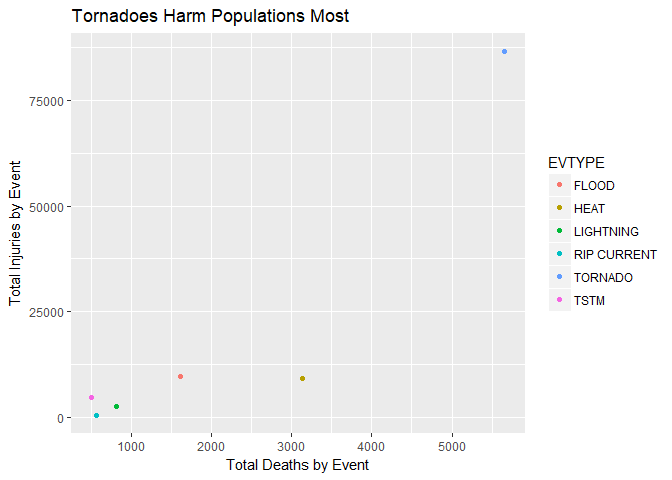
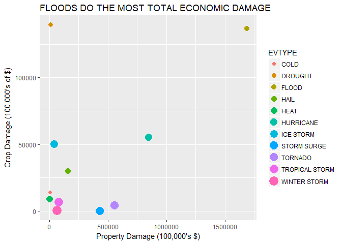

# Tornadoes kill the most people, but Floods destroy our economy
Carlos Mercado  
April 30, 2017  
## Synposis 
Downloading the NOAA data and selecting key columns (property damage, crop damage, weather events, fatalities, and injuries) I analyzed human cost and economic costs of weather events. Filtering each table group (human cost groups being: event type, fatalities, and injuries and economic cost groups being: event type, property damage, and crop damage) involved similar steps. First, identifying the events that had non-zero values (a slim portion of the data). Then subsetting the highest 10% of damages and manually inspecting the event type names. From there, I used gsub to to fix and fuse event names (this was partially a subjective process). After that I summarised each event's sum and plotted those in the top 10% of total damage. For each plot it was clear which events were the most painful.  

## Results 
Tornadoes killed over 5,000 people and injured over 75,000 more. Heat was a distant second. In economic damage, floods lead in property damage while drought does the most crop damage. Floods do the most economic damage in total dollars. 


## Data Processing 

If the file has not already been unzipped, the following if statement will be FALSE and the data will be downloaded, unzipped, and made into data frame, weathd  (weather data). 
The 46.9 MB file may take a minute or so to load. 


```r
if(file.exists("weather") == FALSE){
fileUrl <-"https://d396qusza40orc.cloudfront.net/repdata%2Fdata%2FStormData.csv.bz2"
download.file(fileUrl, destfile = "./weather")
unzip("weather")}

weathd <- read.csv("weather", stringsAsFactors = FALSE) #time consuming 

#902297 rows x 37 columns 
```

Now that the data has been downloaded only certain columns will be selected for the analysis. Specifically: COUNTY, STATE, END_DATE, EVTYPE, FATALITIES, INJURIES, PROPDMG, CROPDMG, REFNUM. 
Any grouping of location will be done by State. End date was selected to best reference when the damages were assessed. Fatalities, injuries, property damage, and crop damage are required for our analysis of human costs and economic costs. Reference Number is useful incase we see our analysis skewed by outlier events. 


```r
allcols <- names(weathd)
selectcols <- c(5,7,8,12,23,24,25:28,37) #positions of each column 

eventd <- select(weathd, selectcols) 

summary(eventd)
```

```
##      COUNTY         STATE              EVTYPE            END_DATE        
##  Min.   :  0.0   Length:902297      Length:902297      Length:902297     
##  1st Qu.: 31.0   Class :character   Class :character   Class :character  
##  Median : 75.0   Mode  :character   Mode  :character   Mode  :character  
##  Mean   :100.6                                                           
##  3rd Qu.:131.0                                                           
##  Max.   :873.0                                                           
##    FATALITIES          INJURIES            PROPDMG       
##  Min.   :  0.0000   Min.   :   0.0000   Min.   :   0.00  
##  1st Qu.:  0.0000   1st Qu.:   0.0000   1st Qu.:   0.00  
##  Median :  0.0000   Median :   0.0000   Median :   0.00  
##  Mean   :  0.0168   Mean   :   0.1557   Mean   :  12.06  
##  3rd Qu.:  0.0000   3rd Qu.:   0.0000   3rd Qu.:   0.50  
##  Max.   :583.0000   Max.   :1700.0000   Max.   :5000.00  
##   PROPDMGEXP           CROPDMG         CROPDMGEXP            REFNUM      
##  Length:902297      Min.   :  0.000   Length:902297      Min.   :     1  
##  Class :character   1st Qu.:  0.000   Class :character   1st Qu.:225575  
##  Mode  :character   Median :  0.000   Mode  :character   Median :451149  
##                     Mean   :  1.527                      Mean   :451149  
##                     3rd Qu.:  0.000                      3rd Qu.:676723  
##                     Max.   :990.000                      Max.   :902297
```

## Which type of events are most harmful to population health? 

In the summary, we see a wide range of Fatalities (0:583), Injuries (0:1700), 
We also see that HAIL, Marine Thunderstorm Wind, and Thunderstorm Wind are the most common event types.

First, let's subset the data specifically for population health where fatalies are NOT equal to zero. This should vastly reduce our dataset, as over 75% of our data has zero fatalities and over 75% of our data has zero injuries. 


```r
quantile(eventd$FATALITIES)
```

```
##   0%  25%  50%  75% 100% 
##    0    0    0    0  583
```

```r
quantile(eventd$INJURIES)
```

```
##   0%  25%  50%  75% 100% 
##    0    0    0    0 1700
```

```r
deadlyd <- subset(eventd, eventd$FATALITIES > 0 | eventd$INJURIES > 0) 
quantile(deadlyd$FATALITIES)
```

```
##   0%  25%  50%  75% 100% 
##    0    0    0    1  583
```

```r
quantile(deadlyd$INJURIES)
```

```
##   0%  25%  50%  75% 100% 
##    0    1    1    3 1700
```

```r
#reducing again based on 75th percentile of each category again 
deadlyd1 <- subset(deadlyd, deadlyd$FATALITIES >= 1 | deadlyd$INJURIES >= 3)

quantile(deadlyd1$FATALITIES)
```

```
##   0%  25%  50%  75% 100% 
##    0    0    1    1  583
```

```r
quantile(deadlyd1$INJURIES) 
```

```
##   0%  25%  50%  75% 100% 
##    0    0    3    6 1700
```

```r
length(unique(deadlyd1$EVTYPE)) 
```

```
## [1] 187
```

Purposely allowing for a case where a massive amount of fatalities or injuries happen independently from the other, we've reduced the data immensely. In this top 1.3% of the data we have 187 Event Types to consider, down from 985. Let's summarise each event's total fatalities and injuries. 


```r
healthdmg <- group_by(deadlyd1, EVTYPE)
healthdmg <- summarise_each(healthdmg, funs(sum), c(FATALITIES,INJURIES))
#187 events
```

Looking at the table (as it is small enough to reasonably view now) the most glaring issue are the input errors in the event names. Capitalization and punctuation problems lead to repeats of event names. While it probably won't change which event is singularly MOST harmful, it could easily affect a top 10 list. We'll have to combine similar EVTYPES. 


```r
#manually looking at the EVTYPES 
evnames <- healthdmg$EVTYPE
#187 unique values, but many are very similar 

#using a giant group of gsubs to fix each group, occasionally combining small groups 

evnames <- gsub(".*AVAL.*","AVALANCHE",evnames)
evnames <- gsub(".*C[Oo][Aa].*F.*", "COASTAL FLOODING", evnames)
evnames <- gsub(".*C[Oo][Ll][Dd].*", "COLD", evnames) #anything with cold
evnames <- gsub(".*H[Ee][Aa][Tt].*", "HEAT", evnames) #anything with heat 
evnames <- gsub(".*F.*[Oo].*", "FLOOD", evnames) #anything with flood 
evnames <- gsub(".*S[Uu][Rr][Ff].*", "SURF", evnames) #anything with surf 
evnames <- gsub("HIGH WIND.*", "HIGH WIND", evnames) #starts with high wind
evnames <- gsub("HURRICANE.*", "HURRICANE", evnames) #starts with hurricane
evnames <- gsub("H[Yy][Pp].*", "HYPOTHERMIA", evnames) 
evnames <- gsub("LANDSLIDE.*","LANDSLIDE", evnames) 
evnames <- gsub("Mudslide.*","MUDSLIDE",evnames)
evnames <- gsub("RIP.*", "RIP CURRENT",evnames)
evnames <- gsub("S[Nn][Oo][Ww].*", "SNOW", evnames) #starts with snow 
evnames <- gsub("S[Tt][Rr][Oo][Nn][Gg].*W.*", "STRONG WIND",evnames) 
evnames <-gsub("THUNDER.*TORM.*W.*", "THUNDERSTORM WIND", evnames) 
evnames <- gsub("TSTM.*", "TSTM", evnames)
evnames <- gsub("TORNAD.*","TORNADO", evnames) #starts with tornad 
evnames <- gsub("W.*FI.*","WILDFIRE", evnames) #has w and fi in name 

#not all names were fixed due to visually obvious lack of fatalities and injuries if combined. 

#assign corrected event names 
healthdmg$EVTYPE <- evnames
#group it again 
healthdmg <- group_by(healthdmg, EVTYPE) 
healthdmg <- summarise_each(healthdmg, funs(sum), c(FATALITIES,INJURIES))
```


Let's look at the quantiles for Fatalities and Injuries and select the deadliest 5% for plotting. 


```r
quantile(healthdmg$FATALITIES, .95) #525
```

```
##   95% 
## 525.5
```

```r
quantile(healthdmg$INJURIES, .95) #2127
```

```
##  95% 
## 2127
```

```r
mostdmg <- subset(healthdmg, 
                  healthdmg$FATALITIES >= 525 | healthdmg$INJURIES >= 2127)

qplot(FATALITIES, INJURIES, data = mostdmg, col = EVTYPE,
      main = "Tornadoes Harm Populations Most", 
      xlab = "Total Deaths by Event", 
      ylab = "Total Injuries by Event")
```

<!-- -->

Tornadoes are far and away the most harmful event to population health with excessive heat a distant second. The other top deadliest events are colored as labeled. 

#Which type of events are most economically damaging? 

Returning to our first trimmed down data set, events data (eventd) we'll select STATE, EVTYPE, PROPDMG, PROPDMGEXP, CROPDMG, CROPDMGEXP and REFNUM. 
While some of the EXP are clearly hundred, thousand, million, or billion, others are not labeled and the documentation does not define them clearly. Thus, we will either multiply the property and crop damage by their numeric EXP equivalent or multiply them by 1(size not labeled in the raw NOAA data report). 


```r
econd <- subset(eventd, select =  c("STATE","EVTYPE","PROPDMG","PROPDMGEXP","CROPDMG","CROPDMGEXP","REFNUM"))

moneylabels <- c("B","b","H","h","K","k","M","m")

#relabel property damage data

#first, if it's not in a money label, it becomes a 1 
econd$PROPDMGEXP <- replace(econd$PROPDMGEXP, 
                            !(econd$PROPDMGEXP %in% moneylabels), 1)

econd$PROPDMGEXP <- gsub("[Bb]", 10^9, econd$PROPDMGEXP) #billions
econd$PROPDMGEXP <- gsub("[Mm]", 10^6, econd$PROPDMGEXP) #millions
econd$PROPDMGEXP <- gsub("[Kk]", 10^3, econd$PROPDMGEXP) #thousands
econd$PROPDMGEXP <- gsub("[Hh]", 10^2, econd$PROPDMGEXP) #hundreds

econd$PROPDMG <- econd$PROPDMG * as.numeric(econd$PROPDMGEXP)  #same length 

#same for crops 
econd$CROPDMGEXP <- replace(econd$CROPDMGEXP, 
                            !(econd$CROPDMGEXP %in% moneylabels), 1)

econd$CROPDMGEXP <- gsub("[Bb]", 10^9, econd$CROPDMGEXP) #billions
econd$CROPDMGEXP <- gsub("[Mm]", 10^6, econd$CROPDMGEXP) #millions
econd$CROPDMGEXP <- gsub("[Kk]", 10^3, econd$CROPDMGEXP) #thousands
econd$CROPDMGEXP <- gsub("[Hh]", 10^2, econd$CROPDMGEXP) #hundreds

econd$CROPDMG <- econd$CROPDMG * as.numeric(econd$CROPDMGEXP) #same length 

quantile(econd$PROPDMG)
```

```
##           0%          25%          50%          75%         100% 
##            0            0            0          500 115000000000
```

```r
quantile(econd$CROPDMG)
```

```
##         0%        25%        50%        75%       100% 
##          0          0          0          0 5000000000
```

Once again, the vast majority of our data is empty, so let's subset based on having non-zero damages and find the top 5% for each value. 


```r
econd <- subset(econd, econd$PROPDMG > 0 | econd$CROPDMG > 0)

length(unique(econd$EVTYPE)) #431 event types have nonzero property or crop DMG
```

```
## [1] 431
```

```r
quantile(econd$PROPDMG, .95) #600,000
```

```
##    95% 
## 600000
```

```r
quantile(econd$CROPDMG, .95) #10,000 
```

```
##   95% 
## 10000
```

Considering the amount of filtering we're doing to get significant data, we're going to worry about fixing event types after subsetting by events that are in the top 5% of property or crop damage - and we will use the same renaming used in the health analysis. The assumption being that events that kill and injury are also those that damage homes and property. This assumption may not hold for crop damage as most fatalities and injuries would be in urban areas with less crops. A spatial analysis would separate damages based on "rural" vs "urban" crop damages - which is beyond the scope of this dataset (i.e., we would need to select which counties are rural vs urban). 


```r
mostecon <- subset(econd, econd$PROPDMG > 600000 | econd$CROPDMG > 10000)
econevnames <- mostecon$EVTYPE 
length(unique(mostecon$EVTYPE)) #167 unique event names 
```

```
## [1] 167
```

```r
#copy paste the previous renaming structure before identifying additional fixes

econevnames <- gsub(".*AVAL.*","AVALANCHE",econevnames)
econevnames <- gsub(".*C[Oo][Aa].*F.*", "COASTAL FLOODING", econevnames)
econevnames <- gsub(".*C[Oo][Ll][Dd].*", "COLD", econevnames) #anything with cold
econevnames <- gsub(".*H[Ee][Aa][Tt].*", "HEAT", econevnames) #anything with heat 
econevnames <- gsub(".*F.*[Oo].*", "FLOOD", econevnames) #anything with flood 
econevnames <- gsub(".*S[Uu][Rr][Ff].*", "SURF", econevnames) #anything with surf 
econevnames <- gsub("HIGH WIND.*", "HIGH WIND", econevnames) #starts with high wind
econevnames <- gsub("HURRICANE.*", "HURRICANE", econevnames) #starts with hurricane
econevnames <- gsub("H[Yy][Pp].*", "HYPOTHERMIA", econevnames) 
econevnames <- gsub("LANDSLIDE.*","LANDSLIDE", econevnames) 
econevnames <- gsub("Mudslide.*","MUDSLIDE",econevnames)
econevnames <- gsub("RIP.*", "RIP CURRENT",econevnames)
econevnames <- gsub("S[Nn][Oo][Ww].*", "SNOW", econevnames) #starts with snow 
econevnames <- gsub("S[Tt][Rr][Oo][Nn][Gg].*W.*", "STRONG WIND",econevnames) 
econevnames <-gsub("THUNDER.*TORM.*W.*", "THUNDERSTORM WIND", econevnames) 
econevnames <- gsub("TSTM.*", "TSTM", econevnames)
econevnames <- gsub("TORNAD.*","TORNADO", econevnames) #starts with tornad 
econevnames <- gsub("W.*FI.*","WILDFIRE", econevnames) #has w and fi in name 

#additional renames for 82 remaining event names 
econevnames <- gsub(".*TROPICAL.*", "TROPICAL STORM", econevnames)
econevnames <- gsub("MARIN.*", "MARINE EVENTS", econevnames) #marine wind/storms
econevnames <-gsub("G[Uu].*","GUSTS", econevnames) 
econevnames <- gsub(".*FREEZE.*", "FREEZE", econevnames) #all freeze types 
econevnames <- gsub(".*HAIL.*", "HAIL", econevnames) #hail 


#replace in table 
mostecon$EVTYPE <- econevnames
```

We'll summarize each type of damage by the event type after grouping. Then we'll plot those events that are in the top 10% of either type of damage.  


```r
mostecon <- group_by(mostecon, EVTYPE)

econdmg <- summarise_each(mostecon, funs(sum), c(PROPDMG,CROPDMG))

top10thprop <- quantile(econdmg$PROPDMG,.9) #5,672,395,500
top10thcrop <- quantile(econdmg$CROPDMG, .9) #765,665,650
top10thprop
```

```
##        90% 
## 5672395500
```

```r
top10thcrop
```

```
##       90% 
## 765665650
```

```r
econdmg1 <- subset(econdmg, econdmg$PROPDMG >= top10thprop |
                                econdmg$CROPDMG >= top10thcrop)

qplot(PROPDMG/100000,CROPDMG/100000, data = econdmg1, col = EVTYPE, 
      size = EVTYPE,  
      main = "FLOODS DO THE MOST TOTAL ECONOMIC DAMAGE",
      xlab = "Property Damage (100,000's $)",
      ylab = "Crop Damage (100,000's of $)")
```

```
## Warning: Using size for a discrete variable is not advised.
```

<!-- -->

Generally speaking, sizing by a discrete variable isn't advisable, but it helps differentiate similar colors and those colors that are not visible for the color-blind. We see that Floods do the most property damage, while drought does the most crop damage. Overall, floods do the most total damage. 


