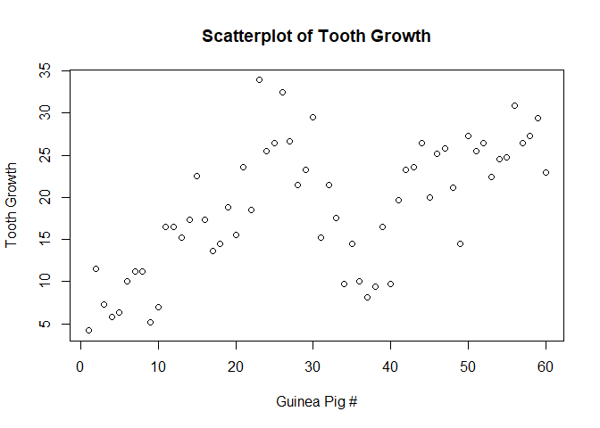
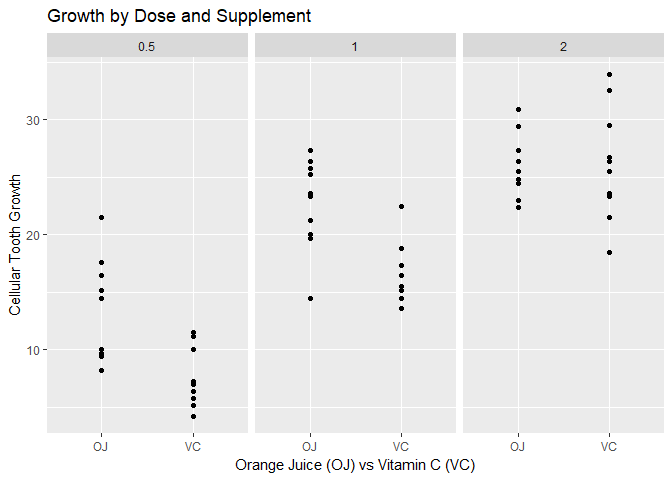

# Exploring and Testing ToothGrowth
Carlos Mercado  
May 3, 2017  


We'll start by loading the dataset and viewing the structure of the data, str().
Background information can be found at https://stat.ethz.ch/R-manual/R-devel/library/datasets/html/ToothGrowth.html 


```r
dteeth <- ToothGrowth


str(dteeth)
```

```
## 'data.frame':	60 obs. of  3 variables:
##  $ len : num  4.2 11.5 7.3 5.8 6.4 10 11.2 11.2 5.2 7 ...
##  $ supp: Factor w/ 2 levels "OJ","VC": 2 2 2 2 2 2 2 2 2 2 ...
##  $ dose: num  0.5 0.5 0.5 0.5 0.5 0.5 0.5 0.5 0.5 0.5 ...
```

We can see that the data frame as 3 columns and 60 rows. Two numeric columns and a Factor column.  

A quick summary of the dataset: 

60 guinea pigs (60 observations) were given one of three different doses of Vitamic C (.5, 1, 2) in milligrams per day. 


```r
unique(dteeth$dose)
```

```
## [1] 0.5 1.0 2.0
```

The method of delivery was either Orange Juice (OJ) or Ascorbic Acid (VC).


```r
summary(dteeth)
```

```
##       len        supp         dose      
##  Min.   : 4.20   OJ:30   Min.   :0.500  
##  1st Qu.:13.07   VC:30   1st Qu.:0.500  
##  Median :19.25           Median :1.000  
##  Mean   :18.81           Mean   :1.167  
##  3rd Qu.:25.27           3rd Qu.:2.000  
##  Max.   :33.90           Max.   :2.000
```

The length of their odontoblasts (tooth growth cells) were measured after the experiment finished (days not specified). They range from 4.2 to 33.9 (units unspecified).  


```r
plot(x = 1:60, y = dteeth$len, xlab = "Guinea Pig #", 
     ylab = "Tooth Growth", main = "Scatterplot of Tooth Growth")
```

<!-- -->

A rudimentary scatterplot shows the range of tooth growth is somewhat correlated with the Guinea Pig's #. This seems to imply that the ordering of the rows (i.e. the dosage amounts or supplement type) seem to play an effect. 

We'll make a three facets (one for each dose) figure and compare tooth growth across supplements.


```r
p <- ggplot(data = dteeth, aes(supp, len)) + facet_grid(.~dose) + geom_point()
p + ggtitle("Growth by Dose and Supplement") + labs(x="Orange Juice (OJ) vs Vitamin C (VC)") + labs(y = "Cellular Tooth Growth")
```

<!-- -->

The following Table shows the mean len (tooth growth) for each supplement (Orange Juice vs Vitamin C) across each dose (.5mg, 1mg, 2mg). 


```r
meanz <- matrix(data = NA, nrow = 2, ncol = 3)
ojmeans = NULL 
vcmeans = NULL
for(i in c(.5,1,2)) {
ojmeans <- c(ojmeans,mean(dteeth[dteeth$supp == "OJ" & dteeth$dose==i,]$len))
vcmeans <- c(vcmeans, mean(dteeth[dteeth$supp =="VC" & dteeth$dose ==i,]$len))
}
meanz <- rbind(ojmeans,vcmeans)
colnames(meanz) <- c(".5mg","1mg","2mg")
rownames(meanz) <- c("OJ","VC")

meanz
```

```
##     .5mg   1mg   2mg
## OJ 13.23 22.70 26.06
## VC  7.98 16.77 26.14
```

At low doses of vitamin C, the supplement seems to affect the tooth growth. We'll do a hypothesis test to identify at which doses this is true, with a 95% confidence interval. The null hypothesis, is that mean(OJ) = mean(VC) at each dose level. 

We have the table of averages, let's create of table of standard deviations. 


```r
standards <- matrix(data = NA, nrow = 2, ncol = 3)
ojsd = NULL 
vcsd = NULL
for(i in c(.5,1,2)) {
ojsd <- c(ojsd,sd(dteeth[dteeth$supp == "OJ" & dteeth$dose==i,]$len))
vcsd <- c(vcsd, sd(dteeth[dteeth$supp =="VC" & dteeth$dose ==i,]$len))
}
standards<- rbind(ojsd,vcsd)
colnames(standards) <- c(".5mg","1mg","2mg")
rownames(standards) <- c("OJ","VC")

standards 
```

```
##        .5mg      1mg      2mg
## OJ 4.459709 3.910953 2.655058
## VC 2.746634 2.515309 4.797731
```

Now, to test our hypothesis that each mean is equal. Note, we are doing 3 tests, so we will also do a few different error corrections as well. To use t.test() we will create six difference vectors ojhalf, vchalf, oj1... etc. 


```r
ojhalf <- dteeth[dteeth$supp == "OJ" & dteeth$dose == .5,] #.5mg/day
vchalf <- dteeth[dteeth$supp == "VC" & dteeth$dose == .5,]

oj1 <- dteeth[dteeth$supp == "OJ" & dteeth$dose == 1,] #1mg/day
vc1 <- dteeth[dteeth$supp == "VC" & dteeth$dose == 1,]

oj2 <- dteeth[dteeth$supp == "OJ" & dteeth$dose == 2,] #2mg/day
vc2 <- dteeth[dteeth$supp == "VC" & dteeth$dose == 2,]
```

When creating these variables, it is clear that they are all the same length (10 observations) which is good for pooling our standard deviations. Note, this data is NOT paired and we will assume the population variances are NOT equal. 


```r
halftest <- t.test(ojhalf$len - vchalf$len)
test1 <- t.test(oj1$len - vc1$len)
test2 <- t.test(oj2$len - vc2$len)

results <- matrix(data = NA, nrow = 3, ncol = 3)

dose <- c(.5,1,2)
pvals <- c(halftest$p.value,test1$p.value,test2$p.value)
meanx <- c(halftest$estimate, test1$estimate, test2$estimate)

results <- cbind(dose, pvals, meanx) 
colnames(results) <- c("Dose","P-Values","Estimated Difference")
rownames(results) <- rep("OJ - VC",3)
results
```

```
##         Dose    P-Values Estimated Difference
## OJ - VC  0.5 0.015472048                 5.25
## OJ - VC  1.0 0.008229248                 5.93
## OJ - VC  2.0 0.966956704                -0.08
```

At alpha = .05 we reject the null that OJ and VC have equal effects on tooth growth at doses .5mg/day and 1mg/day. We fail to reject the null for 2mg/day as the confidence interval contains 0 and the pvalue is above .05. 

Note, for the Bonferroni Correction (m = 3, thus alpha becomes .05/3, or .01667) we reject the null in the same instances and still fail to reject at dose 2mg/day. 


 


